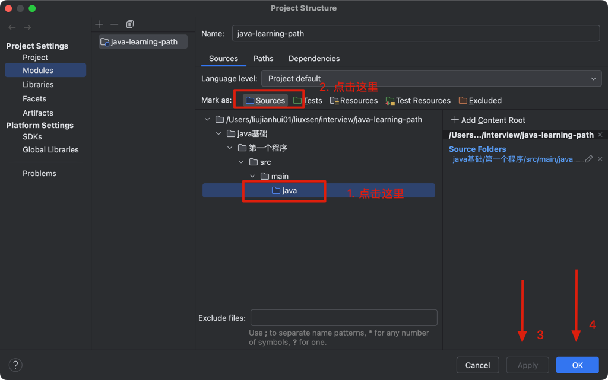
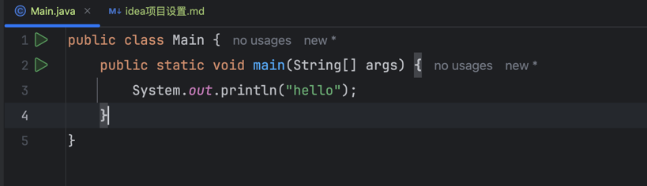

| 标记类型                | 中文意思      | 作用                                                    |
|---------------------|-----------|-------------------------------------------------------|
| Sources Root        | 标记为源码目录   | 编译器会把这里的 .java、.kt 等源码视为主程序的部分；一般是 src/main/java      |
| Test Sources Root   | 标记为测试源码目录 | 这里的源码会被视为测试代码（如 JUnit）；一般是 src/test/java              |
| Resources Root      | 标记为资源目录   | 存放配置文件等非源码内容，如 application.properties，会被打包进 resources |
| Test Resources Root | 测试资源目录    | 一般用于测试环境下读取的资源                                        |
| Excluded            | 排除目录      | IDEA 不会索引/编译这个目录，比如临时文件、构建产物等                         |


设置sources.png

设置module source之后，就可以看到运行按钮.png



新maven项目必须要有pom.xml

maven项目的结构应该是

└── 第一个程序
    └── src
        └── main
            └── java
            └── Main.java
        └── pom.xml

pom.xml 是必须的

1.8 版本的pom.xml

```xml
<project xmlns="http://maven.apache.org/POM/4.0.0"
         xmlns:xsi="http://www.w3.org/2001/XMLSchema-instance"
         xsi:schemaLocation="http://maven.apache.org/POM/4.0.0 
                             http://maven.apache.org/xsd/maven-4.0.0.xsd">

    <modelVersion>4.0.0</modelVersion>

    <groupId>com.example</groupId>
    <artifactId>first-java-app</artifactId>
    <version>1.0-SNAPSHOT</version>

    <properties>
        <maven.compiler.source>1.8</maven.compiler.source>
        <maven.compiler.target>1.8</maven.compiler.target>
        <project.build.sourceEncoding>UTF-8</project.build.sourceEncoding>
    </properties>

    <build>
        <plugins>
            <!-- 编译插件 -->
            <plugin>
                <groupId>org.apache.maven.plugins</groupId>
                <artifactId>maven-compiler-plugin</artifactId>
                <version>3.11.0</version>
            </plugin>

            <!-- 打包为可执行 jar -->
            <plugin>
                <groupId>org.apache.maven.plugins</groupId>
                <artifactId>maven-jar-plugin</artifactId>
                <version>3.3.0</version>
                <configuration>
                    <archive>
                        <manifest>
                            <mainClass>Main</mainClass>
                        </manifest>
                    </archive>
                </configuration>
            </plugin>
        </plugins>
    </build>
</project>
```


