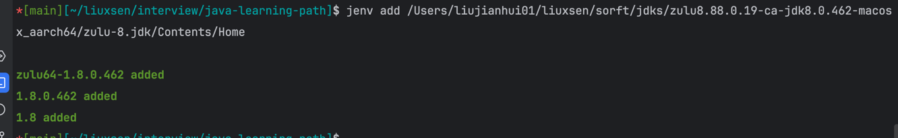

JDK、jvm、jre关系

| 名称  | 包含内容       | 用途            |
|-----|------------|---------------|
| JVM | 只含虚拟机      | 执行字节码         |
| JRE | JVM + 类库   | 运行 Java 程序    |
| JDK | JRE + 开发工具 | 开发和运行 Java 程序 |

老项目、兼容性优先 JDK 8 ； java version "1.8.0_341"

## idea插件推荐
便捷复制图片
[paste-images-into-markdown](https://plugins.jetbrains.com/plugin/8446-paste-images-into-markdown)


## jdk下载
- [zulu jdk](https://www.azul.com/downloads/?package=jdk#zulu)
- [zulu jdk8](https://www.azul.com/downloads/?version=java-8-lts&os=macos&architecture=arm-64-bit&package=jdk#zulu)

解压文件


获取解压的路径

/Users/liujianhui01/liuxsen/sorft/jdks/zulu8.88.0.19-ca-jdk8.0.462-macosx_aarch64/zulu-8.jdk/Contents

## 安装jenv

```
brew install jenv
```
通过以下方式，将jdk添加到jenv中
**注意** 路径具体到Home
```
jenv add /Users/liujianhui01/liuxsen/sorft/jdks/zulu8.88.0.19-ca-jdk8.0.462-macosx_aarch64/zulu-8.jdk/Contents/Home 
```


### 查看添加到jenv的jdk版本
```
jenv versions
```


带*的是默认版本

### 切换版本

```
jenv global 1.8
```

### 查看java版本
```
java -version
```


